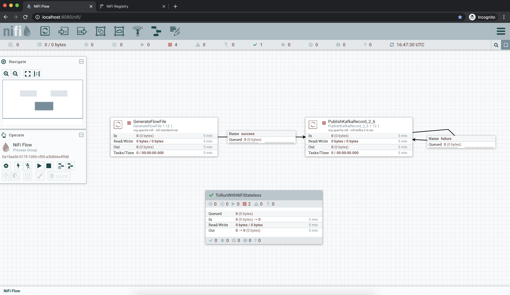
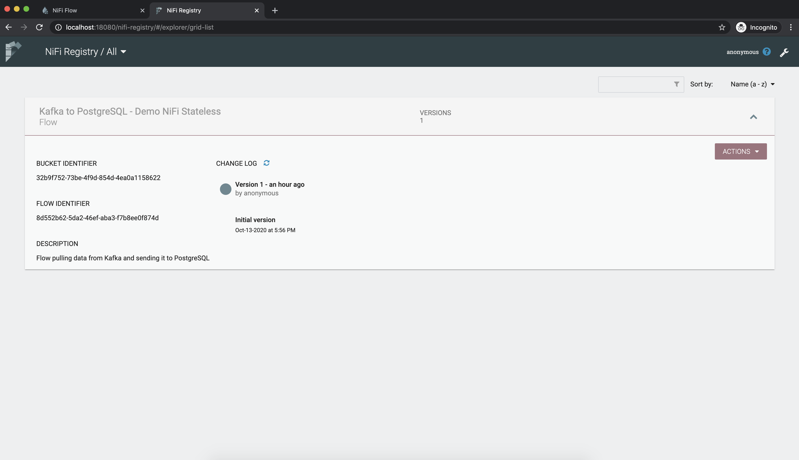
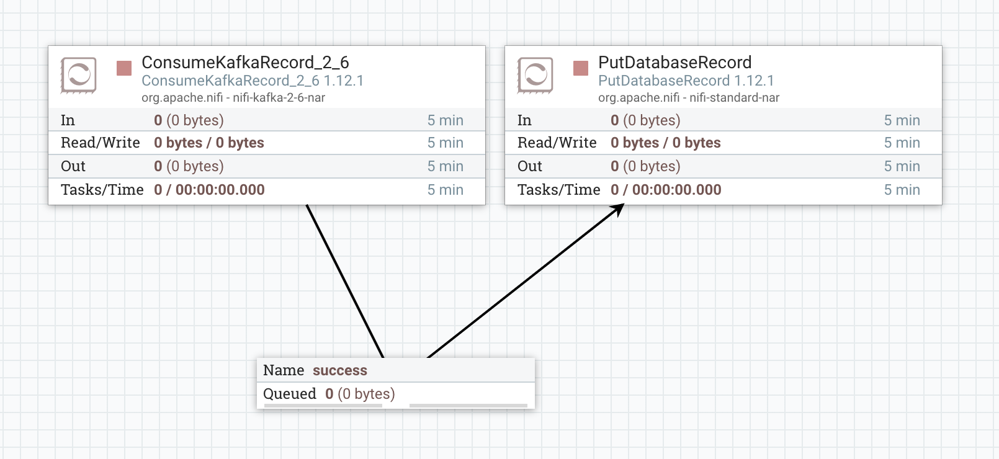
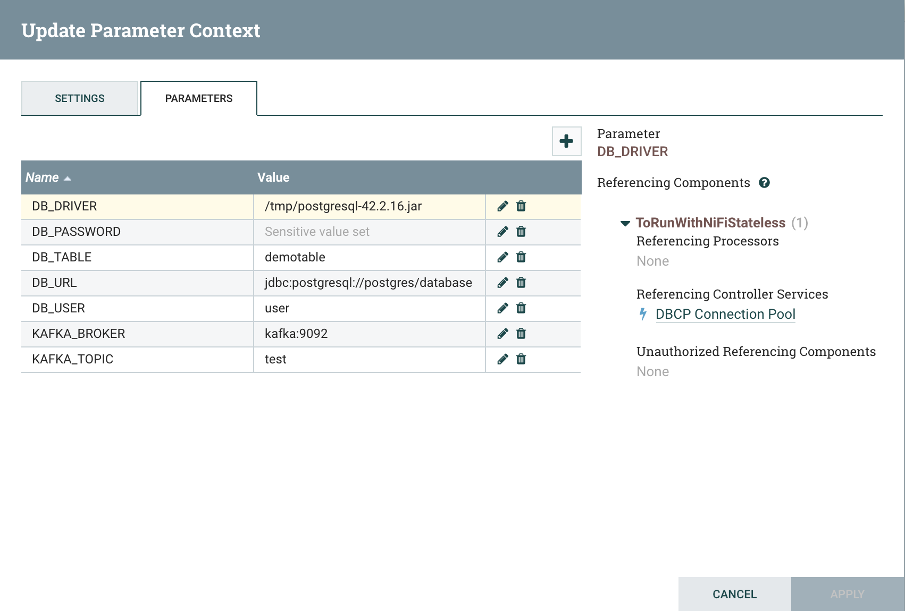

# Easy demo for NiFi Stateless - Kafka to PostgreSQL

A quick setup to demo NiFi Stateless with a flow using Record processors pulling data from a Kafka topic and sending it to a table in PostgreSQL.

This is using:
- Apache NiFi 1.12.1
- Apache NiFi Stateless 1.12.1
- Apache NiFi Registry 0.7.0
- PostgreSQL 12
- And the Kafka 2.6.0 / Zookeeper 3.4.13 docker-compose work from [wurstmeister/kafka-docker](https://github.com/wurstmeister/kafka-docker)

We're deploying a NiFi instance used to design the flow to run in a Stateless mode, and to version it into the Registry. The NiFi instance is also used to generate data into the Kafka topic backed by a single broker. We're also running a PostgreSQL instance where the data will be ingested.

## Getting started

````
git clone https://github.com/pvillard31/nifi-stateless-demo.git
cd nifi-stateless-demo
docker-compose up
````

Once everything is started (it'll take a few minutes to build everything), you can access the NiFi UI at http://localhost:8080/nifi and the NiFi Registry UI at http://localhost:18080/nifi-registry.

You will see the NiFi canvas:



And the NiFi Registry:



You can change the configuration of the GenerateFlowFile processor for the dummy data being generated and sent into Kafka. If you don't want to make any change, you can just start the processor.

You can also see the process group (which is versioned in the NiFi Registry) with the flow that we're going to run in Stateless mode:



The flow has been configured to externalize parameters into a parameter context for which we can change the value when executing the flow in Stateless mode:



## Run the flow with NiFi Stateless

When running a flow with NiFi Stateless, you need to provide details about the flow to run which is stored in the NiFi Registry, and you need to provide the values for the parameters. All of this is configured in the ``flow.json`` file:

````json
{
  "registryUrl": "http://nifi-registry:18080",
  "bucketId": "32b9f752-73be-4f9d-854d-4ea0a1158622",
  "flowId": "8d552b62-5da2-46ef-aba3-f7b8ee0f874d",
  "parameters": {
    "DB_URL": "jdbc:postgresql://postgres/database",
    "DB_PASSWORD": { "sensitive": "true", "value": "password" },
    "DB_USER": "user",
    "DB_DRIVER": "/tmp/postgresql-42.2.16.jar",
    "DB_TABLE": "demotable",
    "KAFKA_BROKER": "kafka:9092",
    "KAFKA_TOPIC": "test"
  }
}
````

To run the flow, you need to be in the ``nifi-stateless-demo`` directory and run the below command:

````
docker run --rm -it -v `pwd`/nifi/postgresql-42.2.16.jar:/tmp/postgresql-42.2.16.jar --link nifi-stateless-demo_nifi-registry_1 --link nifi-stateless-demo_kafka_1 --link nifi-stateless-demo_postgres_1 --net nifi-stateless-demo_default apache/nifi-stateless:1.12.1 RunFromRegistry Continuous --json "`cat flow.json`"
````

This will run the flow in ``Continuous`` mode (always running until you stop it) to pull data from Kafka and send the data into PostgreSQL.

You can check in the PostgreSQL database that the data is correctly ingested (password is ``password``):

````
$ docker exec -it nifi-stateless-demo_postgres_1 /bin/bash
root@f731888104c1:/# psql --username=user --password --dbname=database
Password: 
psql (12.4 (Debian 12.4-1.pgdg100+1))
Type "help" for help.

database=# SELECT count(*) FROM demotable;
 count 
-------
   350
(1 row)

database=# SELECT * FROM demotable LIMIT 1;
      name      | company  |         email         
----------------+----------+-----------------------
 Pierre Villard | Cloudera | pvillard@cloudera.com
(1 row)

````

There is a lot to discuss about NiFi Stateless, this is a very easy specific use case, and it is implemented in a very quick and dirty way for demo purpose. Also, please note that NiFi Stateless is under active development and this demo env might get outdated/obsolete in a near future.

## Housekeeping

Once done, you can stop everything and clean Docker containers and images:

````
docker rm nifi-stateless-demo_nifi_1 nifi-stateless-demo_nifi-registry_1 nifi-stateless-demo_kafka_1 nifi-stateless-demo_postgres_1 nifi-stateless-demo_zookeeper_1
docker rmi nifi-stateless-demo_nifi-registry nifi-stateless-demo_nifi nifi-stateless-demo_kafka apache/nifi-stateless:1.12.1 postgres:12 wurstmeister/zookeeper:latest
````
